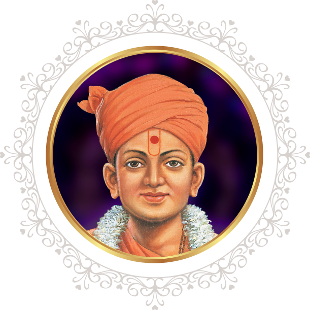
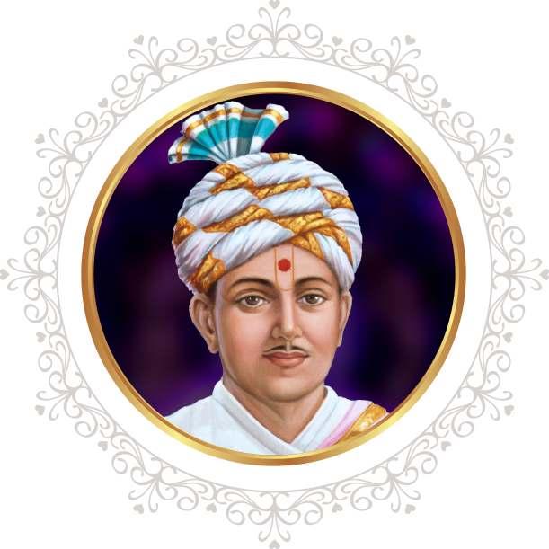
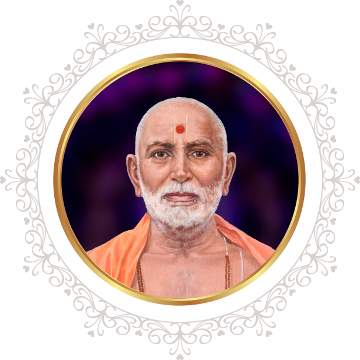
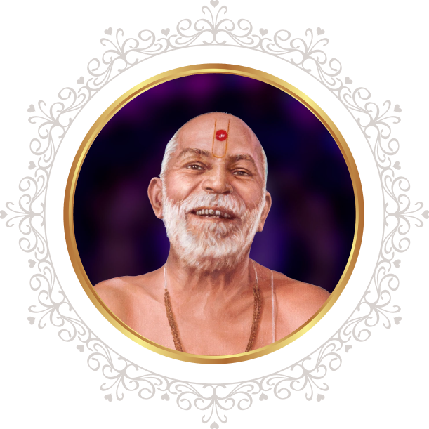
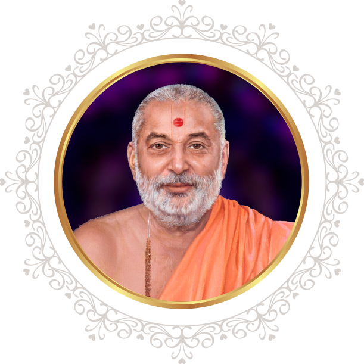
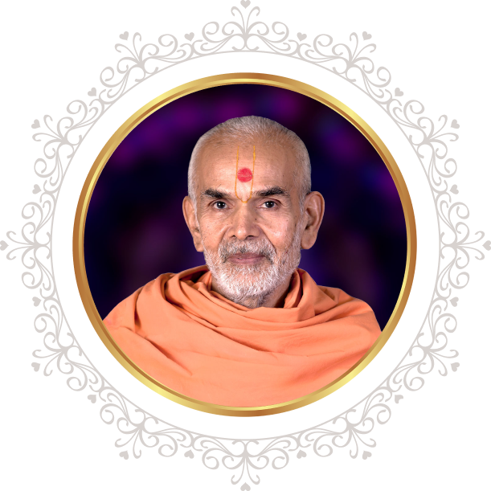

<div style="background:#2a2a2a;color:#fff;height:100%;width:100%;font-family: 'Fira Code';padding-left:20px;">
Uploaded On: 21 April 2023 [Friday]
    
***


# Description

- tab switch webpage.<br/>
- here webpage has made for study & demonstration or understand how tab switch.<br>
```Use In Desktop Mode```<br>
👇here, below demonstrated video--check it

***
[screen-capture.webm](https://user-images.githubusercontent.com/84908224/233576144-8d9bd865-8dd2-4ec3-b233-6298bcd350b5.webm)

***
    
=========================<br>
[𝙲𝚕𝚒𝚌𝚔 𝙼𝚎 𝙵𝚘𝚛 𝙻𝚒𝚟𝚎 𝙳𝚎𝚖𝚘](https://rawcdn.githack.com/tirthbhatt21/Tabs/15a9c5e9af52bd8100ea6d4dbc95d2a871a7731e/index.html)
<br>=========================

Here I shared about used technologies and so on...

<details>
    <summary> Technologies </summary>

***

- [HTML](http://www.w3schools.com/html/default.asp) - A markup language for describing web documents.

- [CSS](http://www.w3schools.com/css/default.asp) - A style sheet language used for describing the look and formatting of a document written in a markup language.

- [Java Script](http://www.w3schools.com/js/default.asp) - A programming language of the Web.

- [cdnjs](https://cdnjs.com/) - cdnjs is a free and open-source software content delivery network hosted by Cloudflare. 
<hr/>
</details>

<details>

<summary> Source Code </summary>

index.html
```html
<!DOCTYPE html>
<html lang="en">
<head>
    <meta charset="UTF-8">
    <meta name="viewport" content="width=device-width, initial-scale=1.0">
    <title>Document</title>
    <link rel="stylesheet" href="style.css">
    <link rel="stylesheet" href="https://cdnjs.cloudflare.com/ajax/libs/font-awesome/5.15.4/css/all.min.css" />
   
</head>
<body>
  
    <section class="main">
    
    <div class="tabbed">
        <input type="radio" name="tabs" id="tab-nav-1" checked>
        <label for="tab-nav-1">Bhagwan Swaminarayan</label>
        <input type="radio" name="tabs" id="tab-nav-2">
        <label for="tab-nav-2">Gunatitanand Swami</label>
        <input type="radio" name="tabs" id="tab-nav-3">
        <label for="tab-nav-3">Bhagatji Maharaj</label>
        <input type="radio" name="tabs" id="tab-nav-4">
        <label for="tab-nav-4">Shastriji Maharaj</label>
        <input type="radio" name="tabs" id="tab-nav-5">
        <label for="tab-nav-5">Yogiji Maharaj</label>
        <input type="radio" name="tabs" id="tab-nav-6">
        <label for="tab-nav-6">Pramukh Swami Maharaj</label>
        <input type="radio" name="tabs" id="tab-nav-7">
        <label for="tab-nav-7">Mahant Swami Maharaj</label>

        <div class="tabs" id="tbs">

            <div>
                <h2>Bhagwan Swaminarayan (1781-1830 CE)</h2>
                <hr>
                
                <p>Bhagwan Swaminarayan manifested in northern India in 1781 CE to grant eternal liberation to countless souls, remove misguided religious practices,, and dispel misinterpretations that had crept into Hinduism.</p>
                <p>Heading a socio-spiritual awakening, he established the Swaminarayan Sampradaya at the age of 20, introducing social reforms, serving the poor and needy, and preaching against superstitions, addictions and violence.

                    During his lifetime, he initiated around 3,000 sadhus (ordained monks), and was recognised and worshipped as Purushottam (supreme God) by countless individuals.
                    
                    To continue his work of moral and spiritual regeneration, he promised to remain ever-present on earth through an unbroken succession of enlightened, God-realised gurus.</p>
            </div>
            <div>
                <h2>Gunatitanand Swami (1784-1867 CE)</h2>
                <hr>
                
                <p>Gunatitanand Swami was the first spiritual successor of Bhagwan Swaminarayan.

                    <p>He lived a life of an ideal sadhu, dedicated to the devotion of God, service of others, and sharing of profound wisdom. His insightful discourses have been recorded as the ‘Swamini Vato’ scripture, which is read daily by thousands of devotees around the world.
                    He was revealed by Bhagwan Swaminarayan to be Akshar, the perfectly enlightened devotee and the closest entity to Purushottam (God) as extolled in the Vedas, Upanishads and Bhagavad Gita.</p>

                    <p>This naturally made him the perfect exponent of Bhagwan Swaminarayan’s supreme divine identity and spiritual philosophy.</p>
                    
                    <p>As the embodiment of Akshar, Gunatitanand Swami remains manifest on earth as the enlightened guru, helping aspirants attain God-realisation.</p>
            </div>
            <div>
                <h2>Bhagatji Maharaj (1829-1897 CE)</h2>
                <hr>
                
                <p>Bhagatji Maharaj was the second spiritual successor of Bhagwan Swaminarayan.</p>

                <p>His intense desire to worship God endeared him to many.</p>
                    
                <p>He worked tirelessly and joyously to serve others despite being shunned and insulted by the ignorant.</p>
                <p>He lived a life of unflinching faith and endeavoured resolutely according to the wishes of his guru Gunatitanand Swami, making him a shining inspiration for all seekers of spiritual enlightenment.</p>

                <p>His saintly virtues and spiritual realisation singled him out as successor to Gunatitanand Swami despite not being a sadhu (ordained monk).</p>
            </div>
            <div>
                <h2>Shastriji Maharaj (1865-1951 CE)</h2>
                <hr>
                
                <p>Shastriji Maharaj was the third spiritual successor of Bhagwan Swaminarayan.</p>

                <p>A profound scholar of Sanskrit and the Hindu scriptures, he was responsible for clearly expounding Akshar-Purushottam Darshan – the upasana of supreme God after becoming enlightened by his ideal devotee – as revealed by Bhagwan Swaminarayan.</p>
                    
                <p>He overcame insurmountable challenges to build five grand mandirs, consecrating within them the images of Gunatitanand Swami (Akshar) and Bhagwan Swaminarayan (Purushottam).</p>
                    
                <p>In 1907, he formally established BAPS Swaminarayan Sanstha (BAPS).</p>
            </div>
            <div>
                <h2>Yogiji Maharaj (1892-1971 CE)</h2>
                <hr>
                
                <p>Yogiji Maharaj was the fourth spiritual successor of Bhagwan Swaminarayan.</p>

                <p>He inspired spiritual activities beyond the borders of India, helping Hindus in Africa, Britain and North America to preserve their faith and values.</p>
                    
                He tirelessly initiated children’s and youth activities, promoting personal spirituality and service to society.

              
                    
                His life was one of endless service, inspiring sermons, and the sharing of his boundless spiritual love and energy.</p>
            </div>
            <div>
                <h2>Pramukh Swami Maharaj (1921-2016 CE)</h2>
                <hr>
                
                <p>Pramukh Swami Maharaj was loved and respected as one of the world’s great spiritual leaders. He lived by and preached the message: “In the joy of others lies our own.”</p>

                <p>Pramukh Swami Maharaj travelled throughout the world, dedicating his life to the well-being of others, visiting more than 250,000 homes in 17,000 villages and cities in more than 50 countries, and personally counselling and comforting more than 810,000 people. He created over 1,100 Hindu mandirs internationally and ordained more than 900 youths into the monastic order to serve society and strive spiritually.</p>
                    
                <p>Driven by his genuine care and compassion for humanity, he inspired many international projects of public service and spiritual uplift, and is remembered as a “people’s guru”, reaching out to all, irrespective of age, class, colour or creed.</p>
                    
                <p>His innate humility, universal wisdom and striking simplicity transformed the lives of millions and touched several religious and national leaders. But most important of all was his quiet, undisturbed love for God, endowing him as an ambassador of love, peace and harmony in the world.</p>
            </div>
            <div>
                <h2>Mahant Swami Maharaj (B. 1933)</h2>
                <hr>
                
                <p>The ‘Pramukh Swami Maharaj Centenary Festival’ is inspired by His Holiness Mahant Swami Maharaj, the sixth spiritual successor of Bhagwan Swaminarayan and present guru of BAPS Swaminarayan Sanstha.</p>

                <p>For over six decades, he served under the guidance of his gurus Yogiji Maharaj and Pramukh Swami Maharaj, tirelessly visiting villages, towns and cities throughout India and the world. His striking humility, serene spirituality and profoundly insightful discourses continue to inspire and strengthen faith and higher living in countless people of all ages around the world.</p>
            </div>

        </div>
        
    </div>


  
</section>

    <script src="https://cdnjs.cloudflare.com/ajax/libs/prefixfree/1.0.6/prefixfree.min.js"></script>

    </body>
    </html>
```
style.css
```css
@import url('https://fonts.googleapis.com/css2?family=Arima:wght@300&display=swap');
* {
  box-sizing: border-box;
}

body {
  overflow-x: hidden;
}
::selection {
  color: #4ec6de;
  background-color: #0f1624;
}
.tabbed {
  width: 100%;
  margin: 50px auto;
}
.tabbed > input {
  display: none;
}
.tabbed > label {
  display: block;
  float: left;
  padding: 12px 20px;
  margin-right: 5px;
  cursor: pointer;
  transition: background-color 0.3s;
}
.tabbed > label:hover,
.tabbed > input:checked + label {
  background: #74747424;
  color: #9D0B0E;
  border: 1px;
}
.tabs {
  clear: both;
  perspective: 600px;
}
.tabs > div {
  position: absolute;
  border: 2px solid #3B200D;
  padding: 10px 30px 30px;
  line-height: 1.4em;
  opacity: 0;
  transform: rotateX(-20deg);
  transform-origin: top center;
  transition: opacity 0.3s, transform 1s;
  z-index: 0;
  box-shadow: 10px 10px 10px 10px;
}
#tab-nav-1:checked ~ .tabs > div:nth-of-type(1),
#tab-nav-2:checked ~ .tabs > div:nth-of-type(2),
#tab-nav-3:checked ~ .tabs > div:nth-of-type(3),
#tab-nav-4:checked ~ .tabs > div:nth-of-type(4),
#tab-nav-5:checked ~ .tabs > div:nth-of-type(5),
#tab-nav-6:checked ~ .tabs > div:nth-of-type(6),
#tab-nav-7:checked ~ .tabs > div:nth-of-type(7)
 {
  transform: rotateX(0);
  opacity: 1;
  z-index: 1;
}
p
{
  color: #3B200D;
}
main
{
  position: relative;
}


@media screen and (max-width: 700px) {
  .tabbed {
    width: 400px;
  }
  .tabbed > label {
    display: none;
  }
  .tabs > div {
    width: 400px;
    border: none;
    padding: 0;
    opacity: 1;
    position: relative;
    transform: none;
    margin-bottom: 60px;
  }
  .tabs > div h2 {
    border-bottom: 2px solid #4ec6de;
    padding-bottom: 0.5em;
  }
}

/* width */
::-webkit-scrollbar {
  width: 10px;
}

/* Track */
::-webkit-scrollbar-track {
  background: #f1f1f1; 
}
 
/* Handle */
::-webkit-scrollbar-thumb {
  background: #888; 
}

/* Handle on hover */
::-webkit-scrollbar-thumb:hover {
  background: #555; 
}

section
{
  width: 100%;
  height: 700px;
  background: #fffcee;
  color: #3B200D;
  font-family: 'Arima', cursive;
  font-weight: 600;
}
```


</details>


*[Back to top](#description)*

<br/>


</div>
